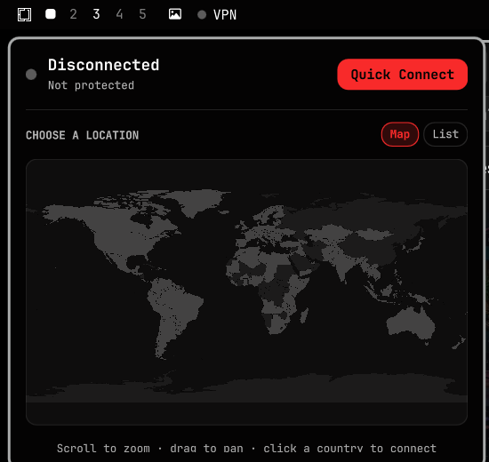

# OmaNord

A NordVPN control widget for the [Omarchy](https://omarchy.org/) shell
(Quickshell). It puts the current VPN country in your bar and opens a
drop-down panel with live network stats and an interactive world map for
picking a country to connect to. Every color is pulled from the active
Omarchy theme, so it restyles itself whenever you run `omarchy theme set`.



## Features

- **Bar widget** — a status dot plus a short label: the connected country
  name, or `VPN` when disconnected. The dot and label use the theme's
  `[bar] active` colour (the same one other widgets use for alerts — red on
  Tokyo Night). Hover for server / IP / uptime.
  - left click — open the panel
  - right click — quick-connect / disconnect
  - middle click — refresh status
  - scroll — cycle through your favorite countries
- **Live stats** (while the panel is open): real-time download / upload
  throughput, server IP, latency, uptime, protocol, and session transfer
  totals.
- **Interactive world map** — equirectangular map drawn from the theme
  palette. Countries with NordVPN servers are highlighted; hover to see the
  server count, click to connect. Scroll to zoom, drag to pan. Your current
  country and favorites are tinted with the same accent colour as the rest
  of the UI.
- **Searchable country list** — favorites first (★ to pin), then every
  country with its server count. Type a name and press Enter to connect to
  the top match.
- **Quick Connect** to the fastest server, or to a fixed country you set in
  the widget options.
- **Guided first-run setup** — on a machine that isn't fully set up yet, the
  panel shows one blocker at a time instead of the normal UI:
  - NordVPN CLI not installed → a copyable install command, auto-clears once
    it's found.
  - Your user not in the `nordvpn` group → one button (`pkexec usermod -aG
    nordvpn <you>`).
  - The `nordvpnd` service not running → one button (`pkexec systemctl
    enable --now nordvpnd`).
  - Not logged in → **Log in with browser** (runs `nordvpn login`, which
    opens your browser itself, then polls until it completes).

The panel is pinned to the widget's position when it opens, so it never
drifts as the country name changes.

## Requirements

- Omarchy shell (Quickshell-based bar)
- The `nordvpn` CLI (see Install below) — if it's missing, not yet
  permissioned, or not logged in, the panel walks you through fixing that
  itself; you don't need to do any of it up front.

## Install

```bash
omarchy plugin add https://github.com/AyanMulla09/OmaNord.git --enable --yes
omarchy bar move ayan.nordvpn --section right
```

Or by hand:

```bash
git clone https://github.com/AyanMulla09/OmaNord.git \
  ~/.config/omarchy/plugins/ayan.nordvpn
omarchy-shell shell rescanPlugins
omarchy plugin enable ayan.nordvpn
omarchy bar move ayan.nordvpn --section right
```

## Uninstall

```bash
omarchy plugin remove ayan.nordvpn --yes
```

Or by hand: remove it from the bar in `~/.config/omarchy/shell.json`, delete
`~/.config/omarchy/plugins/ayan.nordvpn`, then `omarchy-shell shell
rescanPlugins`. This only removes the widget itself — it never touches your
NordVPN login, connection, or CLI settings, and your favorites/recents file
at `~/.local/state/omarchy-nordvpn/prefs.json` is left in place in case you
reinstall later (delete it too if you want a completely clean slate).

## Options

Set on the widget's entry in `~/.config/omarchy/shell.json`:

| Key                  | Default | Meaning                                                        |
|----------------------|---------|---------------------------------------------------------------|
| `quickConnectTarget` | `""`    | Quick-connect destination — blank = fastest, else a country name or ISO code |

## Updating the bundled data

`data/countries.json` (server counts + city lists) and
`data/world-paths.json` (country outlines) are committed so the plugin works
offline. To refresh them:

```bash
node scripts/refresh-data.mjs
```

This pulls the current country/server list from the public NordVPN API and
re-projects the amCharts world geodata into the map's viewBox.

## Notes

- Quickshell layer surfaces don't provide a working `Canvas`, so the map is
  drawn with `QtQuick.Shapes` and hit-tested with a manual ray-cast.
- Favorites and recents are stored in
  `~/.local/state/omarchy-nordvpn/prefs.json`.

## License

MIT — see [LICENSE](LICENSE). Unofficial community project; not affiliated
with NordVPN.
